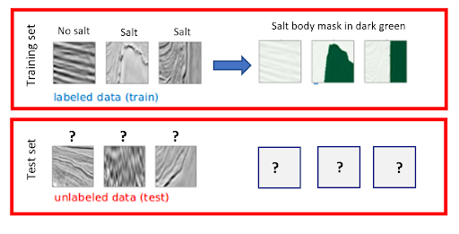

# Subsurface Salt Interpretation Automation
## *Enhancing ML workflow for semantic segmentation* 

<br><br><br>


Team Members: 

Brandt Green<br>
Yi-Ting (Branda) HuangJessie Lee
Meha Mehta
Shengxiang Wu


```
# Number of inputs equals the number of pixels in our images * number of channels, which in this case is 1 because the images are greyscale.

inputs = Input((IMG_WIDTH, IMG_HEIGHT, 1))
 
# Layer to convert the pixels to 0-1 scales which is expected from later on layers
s = Lambda(lambda img_pixels: img_pixels / 255) (inputs)


c1 = Conv2D(filters = 8, kernel_size=(3,3), activation='relu', padding='same') (s)
c1 = Conv2D(filters = 8, kernel_size=(3,3), activation='relu', padding='same') (c1)
p1 = MaxPooling2D((2, 2)) (c1)

c2 = Conv2D(filters = 16, kernel_size=(3,3), activation='relu', padding='same') (p1)
c2 = Conv2D(filters = 16, kernel_size=(3,3), activation='relu', padding='same') (c2)
p2 = MaxPooling2D(pool_size=(2, 2)) (c2)
```


## Abstract

Accurately identifying subsurface salt deposits from seismic images is an important, yet time consuming step in the exploration and development of oil and gas resources in the energy industry. This process is undertaken in order to discover new resources and avoid hazards in certain basins globally. Each year, a large amount of employee hours are spent interpreting salt bodies in 3D seismic volumes. In this article we propose an alternative, machine learning driven approach to automating the process. 

The current model we have developed is built on 4000 original input 2D salt images, sliced from 3D seismic volumes and paired with a mask image that is created from a human expert's interpretation. Due to the limited size of the learning set, image augmentation was performed to generate a larger training set. We then utilize a fully convolutional network model, with the U-NET architecture, that takes an input image and outputs a 2D “salt mask” that identifies where salt is located in the input image. This output image is then compared with the original mask generated by human interpreters to calculate error metrics.  Our final model,evaluated on the hold out set, achieved an average pixel wise accuracy of 93.4% and a mean IOU of 72.4%.




