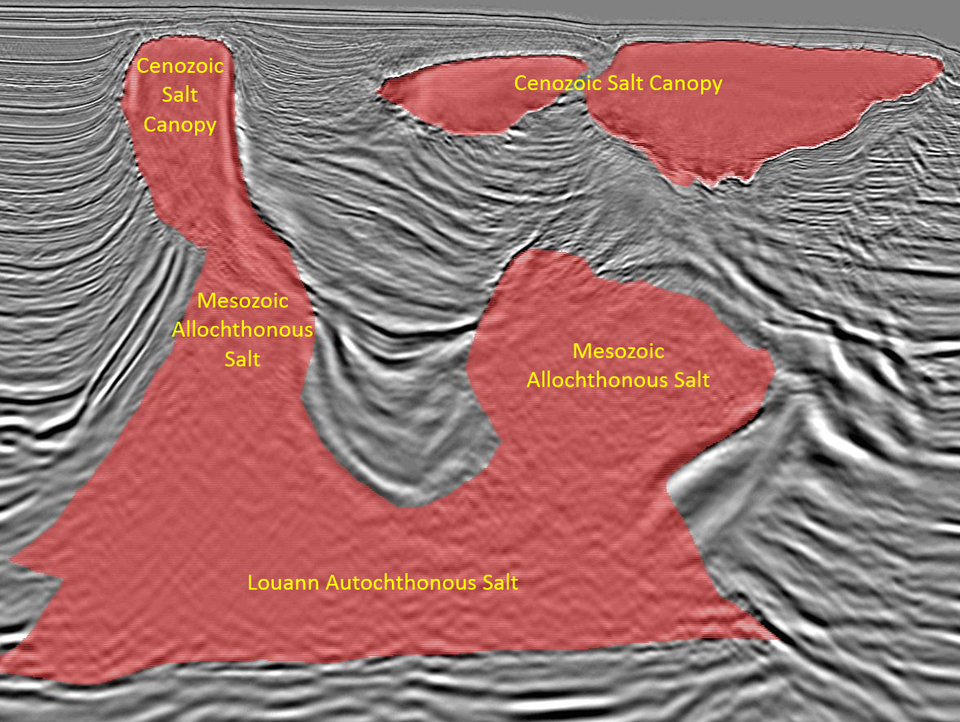

# Subsurface Salt Interpretation Automation
## *Enhancing ML workflow for semantic segmentation* 

   

Team Members: 

Brandt Green 
Yi-Ting (Branda) HuangJessie Lee
Meha Mehta
Shengxiang Wu

## Abstract

Accurately identifying subsurface salt deposits from seismic images is an important, yet time consuming step in the exploration and development of oil and gas resources in the energy industry. This process is undertaken in order to discover new resources and avoid hazards in certain basins globally. Each year, a large amount of employee hours are spent interpreting salt bodies in 3D seismic volumes. In this article we propose an alternative, machine learning driven approach to automating the process. 

The current model we have developed is built on 4000 original input 2D salt images, sliced from 3D seismic volumes and paired with a mask image that is created from a human expert's interpretation. Due to the limited size of the learning set, image augmentation was performed to generate a larger training set. We then utilize a fully convolutional network model, with the U-NET architecture, that takes an input image and outputs a 2D “salt mask” that identifies where salt is located in the input image. This output image is then compared with the original mask generated by human interpreters to calculate error metrics.  Our final model,evaluated on the hold out set, achieved an average pixel wise accuracy of 93.4% and a mean IOU of 72.4%.

 
Link to Implementation in notebook: [Notebook Github](https://github.com/Brandt-moreThan4/UT-Projects/blob/master/Advanced_Machine_Learning/Subsurface_Salt_Interpretation/code_team_contrasting_channel_final.ipynb)

 
# 1. Statement of Purpose

## 1.1 Why are we interested in salt?

Before getting too into the weeds on the data set and model building, we would like to provide further background information on salt’s origins and relevance. Salt was deposited when oceans started to open millions of years ago and later arose through earth’s strata due to its plasticity and relatively low density, to form variable shaped bodies such as  domes, canopies or diapirs. In places such as West Africa, the Gulf of Mexico and North sea, billions of barrels of hydrocarbon resources (oil and gas) were trapped  above and around salt due to its very low permeability. As a result, salt related structures are hot targets for oil and gas exploration because often, finding salt can mean finding oil. (Fig. 1). 

**
Figure 1. Salt Trap for Oil
**

  

Aside from facilitating oil discovery, knowing the location of salt deposits also bears significance with respect to drilling safety. If the salt appears too shallow with trapped gas, it could be a drilling hazard that if not properly planned for and handled could cause explosions. Therefore, accurately identifying salt becomes critical for drilling safety.

Clearly, identifying and accurately mapping salt deposits is critical in the oil and gas industry. Unfortunately, human interpretation of salt bodies on seismic data is tedious, time consuming and often subjective. The turnaround time of an expert’s manual salt interpretation could take months. By applying machine learning algorithms, we hope to build the first piece of an ML workflow that automatically and accurately identifies salt bodies using 2D seismic images. While we do not tackle the challenge here, the next phase of the complete workflow would involve piecing together the 2D interpretations into 3D seismic volumes. The new process will take a few hours to a few days; a drastic improvement upon current methodologies. This efficiency gain removes one bottleneck in the project timeline which would ultimately create substantial economic value on a high capex project.

## 1.2 Image characteristics of salt

How exactly are these seismic images obtained? Subsurface salt bodies are almost exclusively imaged using a technique called reflection seismology. [1] In offshore environments, this entails air guns shooting sound waves to the ocean bottom (Fig.2; [2]), which are then reflected by earth’s strata. The reflected waves are recorded by hydrophones and the data is processed to form a 3D seismic volume from which geoscientists interpret various subsurface features, e.g., salt bodies (Fig. 3). The 3D volume is then sliced into a series of 2D images for salt interpretation and later, can then be resembled to represent a 3D body.

**
Figure 2. Seismic Acquisition
**

**
Figure 3. Seismic Data with Salt in Depth
**

The strength of seismic reflections at any boundary is defined by the equation [3,4]:

Where RC is the reflection coefficient of compressional waves,  ρ2, v2  and ρ1, v1 are the density and travel velocity of compressional waves in overlain medium 2 and underlain medium 1 respectively. Due to the high velocity (V2) of compressional waves in salt (~4400 m/s) compared with surrounding sediment,  (ρ2v2 - ρ1v1) term is large resulting in strong positive inflection at top salt, where salt base is characterized by a strong negative reflection. 

When human experts (geoscientists) examine the images, there are a few characteristics that help them identify the areas containing salt:
1. Top of salt is normally a strong peak (a convoluted positive reflection), while the base is a strong trough (negative reflection).
2. The interior of a salt body is relatively homogeneous and lacks layered structure as surrounding sediments. However, enclaves and impurities trapped inside salt could cause disturbances and the development of more complex texture.

When salt - sediment boundary is close to vertical, sound waves coming from above would have incident angle semi-parallel to the boundary, resulting in refraction and diffraction of energy that causes complexity in imaging.
When salt bodies are stacked, the energy of upper salts can attenuate (weaken) the seismic energy where the lower salt image can be blurred.
 
In summary, the characters and features of salt in seismic images present several challenges for human experts, and we can expect some of these same challenges to cause trouble for our ML models. In this study, we are trying to leverage our domain knowledge and train the model purposefully to address the challenges while maximizing the distinguishing characters of salt bodies.

# 2. Dataset
## 2.1 Data Description
The data for this project came straight from a Kaggle Competition: TGS Salt Identification Challenge [5]. From this challenge, we were able to download 4,000 image pairs where each pair consists of a 101x101 pixel seismic image of the earth’s subsurface, and its corresponding 101x101 pixel "salt mask", where white pixels represent the human interpretation of salt bodies. Here's a sample of the first 6 image pairs in the data set (Fig 4):

**
Figure 4 Original training set image pairs (seismic image and mask) ** *Note: Salt is indicated by the white shading.*
*

The images we have are simply cross-sectional slices of the 3D view obtained from reflection seismology as explained above. These images are stored in grayscale format, meaning each pixel has only one color value, between 0-255. This contrasts with a typical color image where each position contains 3 pixels for each RGB value. The “Salt-Mask” is created from an expert’s manual labeling which is considered the ground truth. Finally, on top of the images, we were also provided information on the depth of the imaged location.

## 2.2 Data Processing & Exploration
### 

### 2.2.2 Data Splitting
### 2.2.3 Data Alchemy
# 3. Common ML Image Tasks & Model Overview
## 3.1 Images and Machine Learning
## 3.2 Choosing a Model
# 4. UNET Implementation
## 4.1 What is U-NET?
## 4.2 Base U-Net model Implementation:
## 4.3 Enhancements on the Base Unet Model:
# 5. Model Training and Results
## 5.1 Metrics
## 5.2 Results
## 5.3 Model at Work
# 6. Conclusion
## 6.1 Key Takeaways
## 6.2 Future work
# 7. References
