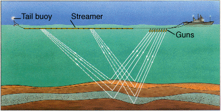
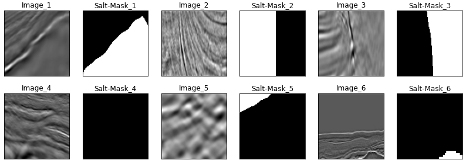
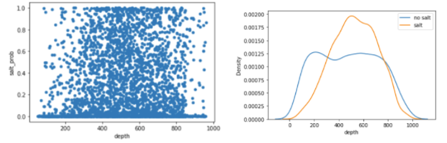
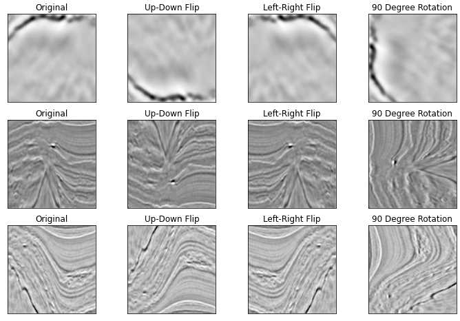
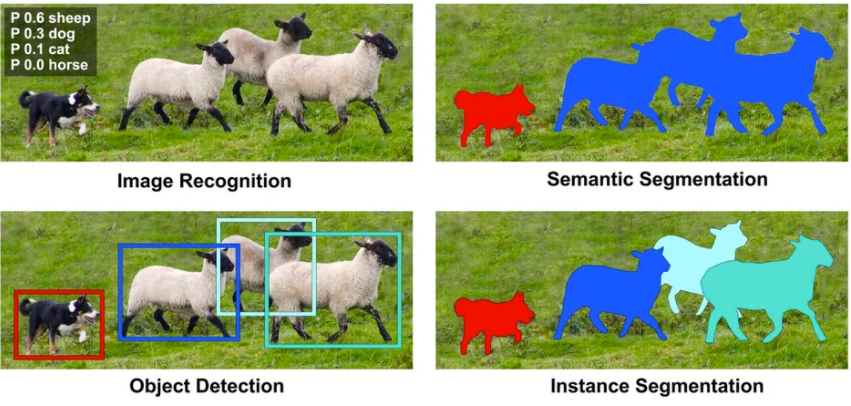
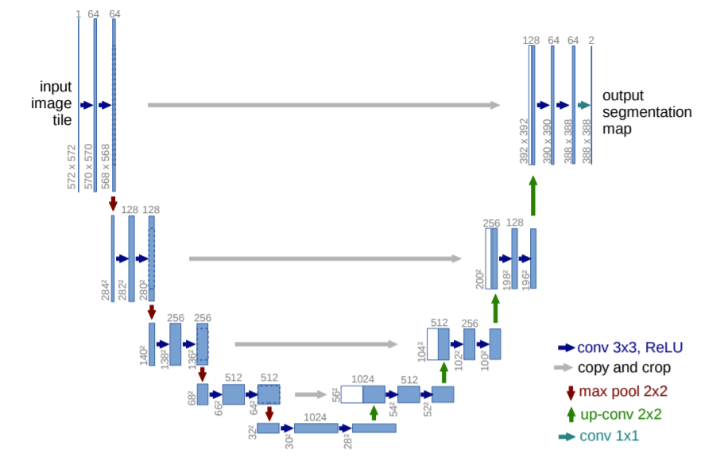

# Subsurface Salt Interpretation Automation
## *Enhancing ML workflow for semantic segmentation* 

<br><br><br>


Team Members: 

Brandt Green<br>
Yi-Ting (Branda) HuangJessie Lee
Meha Mehta
Shengxiang Wu


## Abstract

Accurately identifying subsurface salt deposits from seismic images is an important, yet time consuming step in the exploration and development of oil and gas resources in the energy industry. This process is undertaken in order to discover new resources and avoid hazards in certain basins globally. Each year, a large amount of employee hours are spent interpreting salt bodies in 3D seismic volumes. In this article we propose an alternative, machine learning driven approach to automating the process. 

The current model we have developed is built on 4000 original input 2D salt images, sliced from 3D seismic volumes and paired with a mask image that is created from a human expert's interpretation. Due to the limited size of the learning set, image augmentation was performed to generate a larger training set. We then utilize a fully convolutional network model, with the U-NET architecture, that takes an input image and outputs a 2D “salt mask” that identifies where salt is located in the input image. This output image is then compared with the original mask generated by human interpreters to calculate error metrics.  Our final model,evaluated on the hold out set, achieved an average pixel wise accuracy of 93.4% and a mean IOU of 72.4%.


<br>
Link to Implementation in notebook: [Notebook Github](https://github.com/Brandt-moreThan4/UT-Projects/blob/master/Advanced_Machine_Learning/Subsurface_Salt_Interpretation/code_team_contrasting_channel_final.ipynb)


<br>
# 1. Statement of Purpose

## 1.1 Why are we interested in salt?

Before getting too into the weeds on the data set and model building, we would like to provide further background information on salt’s origins and relevance. Salt was deposited when oceans started to open millions of years ago and later arose through earth’s strata due to its plasticity and relatively low density, to form variable shaped bodies such as  domes, canopies or diapirs. In places such as West Africa, the Gulf of Mexico and North sea, billions of barrels of hydrocarbon resources (oil and gas) were trapped  above and around salt due to its very low permeability. As a result, salt related structures are hot targets for oil and gas exploration because often, finding salt can mean finding oil. (Fig. 1). 


**<center>Figure 1. Salt Trap for Oil</center>**

<br><br>

Aside from facilitating oil discovery, knowing the location of salt deposits also bears significance with respect to drilling safety. If the salt appears too shallow with trapped gas, it could be a drilling hazard that if not properly planned for and handled could cause explosions. Therefore, accurately identifying salt becomes critical for drilling safety.


Clearly, identifying and accurately mapping salt deposits is critical in the oil and gas industry. Unfortunately, human interpretation of salt bodies on seismic data is tedious, time consuming and often subjective. The turnaround time of an expert’s manual salt interpretation could take months. By applying machine learning algorithms, we hope to build the first piece of an ML workflow that automatically and accurately identifies salt bodies using 2D seismic images. While we do not tackle the challenge here, the next phase of the complete workflow would involve piecing together the 2D interpretations into 3D seismic volumes. The new process will take a few hours to a few days; a drastic improvement upon current methodologies. This efficiency gain removes one bottleneck in the project timeline which would ultimately create substantial economic value on a high capex project.


## 1.2 Image characteristics of salt

How exactly are these seismic images obtained? Subsurface salt bodies are almost exclusively imaged using a technique called reflection seismology. [1] In offshore environments, this entails air guns shooting sound waves to the ocean bottom (Fig.2; [2]), which are then reflected by earth’s strata. The reflected waves are recorded by hydrophones and the data is processed to form a 3D seismic volume from which geoscientists interpret various subsurface features, e.g., salt bodies (Fig. 3). The 3D volume is then sliced into a series of 2D images for salt interpretation and later, can then be resembled to represent a 3D body.


**<center>Figure 2. Seismic Acquisition</center>**


**<center>Figure 3. Seismic Data with Salt in Depth</center>**

The strength of seismic reflections at any boundary is defined by the equation [3,4]:


Where RC is the reflection coefficient of compressional waves,  ρ2, v2  and ρ1, v1 are the density and travel velocity of compressional waves in overlain medium 2 and underlain medium 1 respectively. Due to the high velocity (V2) of compressional waves in salt (~4400 m/s) compared with surrounding sediment,  (ρ2v2 - ρ1v1) term is large resulting in strong positive inflection at top salt, where salt base is characterized by a strong negative reflection. 

When human experts (geoscientists) examine the images, there are a few characteristics that help them identify the areas containing salt:
1. Top of salt is normally a strong peak (a convoluted positive reflection), while the base is a strong trough (negative reflection).
2. The interior of a salt body is relatively homogeneous and lacks layered structure as surrounding sediments. However, enclaves and impurities trapped inside salt could cause disturbances and the development of more complex texture.

When salt - sediment boundary is close to vertical, sound waves coming from above would have incident angle semi-parallel to the boundary, resulting in refraction and diffraction of energy that causes complexity in imaging.
When salt bodies are stacked, the energy of upper salts can attenuate (weaken) the seismic energy where the lower salt image can be blurred.
 
In summary, the characters and features of salt in seismic images present several challenges for human experts, and we can expect some of these same challenges to cause trouble for our ML models. In this study, we are trying to leverage our domain knowledge and train the model purposefully to address the challenges while maximizing the distinguishing characters of salt bodies.


# 2. Dataset
## 2.1 Data Description
The data for this project came straight from a Kaggle Competition: TGS Salt Identification Challenge [5]. From this challenge, we were able to download 4,000 image pairs where each pair consists of a 101x101 pixel seismic image of the earth’s subsurface, and its corresponding 101x101 pixel "salt mask", where white pixels represent the human interpretation of salt bodies. Here's a sample of the first 6 image pairs in the data set (Fig 4):


**<center>Figure 4 Original training set image pairs (seismic image and mask)<br>** *Note: Salt is indicated by the white shading.*</center>*

The images we have are simply cross-sectional slices of the 3D view obtained from reflection seismology as explained above. These images are stored in grayscale format, meaning each pixel has only one color value, between 0-255. This contrasts with a typical color image where each position contains 3 pixels for each RGB value. The “Salt-Mask” is created from an expert’s manual labeling which is considered the ground truth. Finally, on top of the images, we were also provided information on the depth of the imaged location.


## 2.2 Data Processing & Exploration
### 2.2.1 Depth

As mentioned,depth information of the imaged salt bodies was provided. However, based on our domain knowledge of salt bodies in geoscience, the chance of salt occurrence is normally uncorrelated with the depth at which the body is located. To test this assertion, we conducted a brief exploratory analysis to see if we could identify any patterns that we were missing, but as you can see from the graphs below, depth really does not hold any value to this problem (Fig. 5).



**<center>Figure 5. The salt probability vs. depth (left: probability salt occurance of salt within each image vs. depth of the salt; right: probability of image with salt vs. without salt vs. depth)</center>**


### 2.2.2 Data Splitting

After we downloaded the 4,000 image pairs from the Kaggle competition we took 3,500 of these pairs to be our training data and set aside 500 as our final validation set. The Kaggle competition creators also provided 18,000 images as their test set, but these were only provided for the competition evaluation purposes and thus did not have accompanying salt-masks, meaning they were of no use to us. 

### 2.2.3 Data Alchemy
Obviously, for an image-related ML task, having only 3500 images to train a model hardly inspires much excitement. Fortunately, we stumbled upon a technique called Data Augmentation that allows you to synthetically increase the size of your training dataset. Data augmentation works by creating new data that are slightly modified, yet still realistic versions of the original dataset. With our particular dataset, we decided to apply three augmenting methods: Up-Down Flips, Left-Right Flips, and a 90 degree rotation. Each of these transformations was applied to every training set image, resulting in a revised training set sample size of 14,000 images. Examples of the transformations for 3 images are depicted below (Fig. 6):


**<center>Figure 6. Data Augmentation (Up-Down Flip, Left-Right Flip, 90 Degree Rotation)</center>**

Initially, this artificial data creation felt more like data wizardry than data science, but after researching and experimenting more, we began to appreciate its utility. Data augmentation can be a powerful tool because it makes the model more robust by ensuring the model does not overfit to certain irrelevant positional characteristics.

# 3. Common ML Image Tasks & Model Overview
## 3.1 Images and Machine Learning
Before diving into what models are available and which one we chose to solve this problem, we think it’s helpful to examine at a high level, some of the common image related problems in the world of machine learning. The image below gives a great representation what four of the big tasks are trying to accomplish:

**<center>Figure 7. Image segmentation illustration</center>**

* **Image Recognition**: First, there’s image recognition. Basically, you just want to predict what is in the image. This takes the mathematical form of estimating probabilities for each of the potential classes. 
* **Object Detection**: The next logical step, after recognizing what the image contains is to actually identify where in the image, the detected objects are. This involves not only estimating probabilities for what an object may be, but actually predicting a bounding box that encloses the object. This is typically expressed as a regression task by predicting the coordinates of the pixel located at the center of the object and then predicting the object's width and height. When put together, these components represent the box containing the object.
* **Semantic Segmentation**: Drawing a box around objects in the image is neat, but there are certain problems where a box may be too coarse and imprecise to truly address the task at hand. This is where semantic segmentation comes in. Semantic segmentation seeks to predict on a pixel by pixel basis the exact shape of the object. As can be seen in the image above, the pixels representing sheep are all identified as one class and the pixels corresponding to the dog are represented by the next class. This is exactly what our project entails, only instead of predicting the pixel masks for sheep and dogs, we’ll be outputting predicted probabilities for salt or not-salt.
* **Instance Segmentation**: Finally, there is one additional extension for many projects that could be implemented. Semantic segmentation lumps all pixels corresponding to the same class into one chunk which is often fine, but in certain situations you may need the extra precision of actually identifying  that one blob of pixels representing “sheep” is different from the next blob of sheep pixels. When this distinction is necessary, the problem being solved is instance segmentation, but it is beyond the scope of our project because we do not need to distinguish between different clumps of salt in our images.


## 3.2 Choosing a Model
We now have a pretty clear picture of our goal: solve a semantic segmentation problem where the input is a seismic image, and the output is also an image that highlights the sections of the input image containing salt. To accomplish this goal, we explored several models and our thought process followed like below.

**Multi-Layer Perceptron (MLP)**: This is typically the “starter” model for anyone learning about neural networks and it would be quite a win if it also worked on image related problems. Unfortunately, there are two thorny problems with MLPs when applied to images. First, the number of trainable parameters in the model will explode when using anything other than a trivially small image. This issue arises because the input to the MLP model will be a flattened array of every pixel in the image, and with multiple fully connected layers, the parameter count rapidly grows unwieldy. Second, MLPs suffer from another related problem: overfitting the training data. MLPs are notoriously bad at understanding positional invariance, meaning they struggle to learn that the same object can appear in multiple different areas of the image. For example, if your model only contained training images where sheep were on the right hand side of the image, it would struggle to recognize a sheep on the left hand side of the image in the testing data. Clearly, MLPs are not going to work for our task.

**Convolutional Neural Network (CNN)**: Fortunately, using a convolutional neural network solves many of the problems associated with MLPs. The two key components of CNNs, convolutional filters and pooling, work together to solve the problems of the MLP. A useful characteristic of the filters is that for each filter in a convolutional layer, all of the pixels share the same trainable parameters. This helps to reduce both the complexity by reducing the parameter count, and increases the models robustness to positional invariance because the same filter is applied to pixels in all positions of the image. The pooling layer also contributes to complexity reduction since the output shrinks the number of inputs fed to the next layer.These operations work together to help the model understand the “what” of the image which is necessary for a standard classification task, but the model as a whole tends to fall short when a probability prediction is needed for every single  input pixel provided. The cause of this deficiency is mainly due to the repeated application of max pooling layers because with each downsampling, some of the precise localized information is lost.On top of that, a CNN is typically topped off with a fully connected  dense layer which works well if you are predicting class probabilities, but not for predicting probabilities for each pixel. [6,7]

**Fully Convolutional Network (FCN)**: Fully convolutional networks were introduced as an extension to CNNs with semantic segmentation tasks in mind. [8] The main addition of the fully convolutional neural network is that the final fully connected layer of a CNN is chopped off and instead replaced by another convolutional layer with one filter and one channel. By doing this, this output will be a 2D feature map of the exact same size as the original image and we can interpret the output numbers as class probabilities. An added benefit of removing the fully connected layer is that you can now send in images of multiple different sizes to the model because none of the layers require a specific input size. 

Using an FCN seems appropriate for our challenge, but an FCN is actually just a general methodology that does not tell us how to specifically structure our model. Fortunately, we can build on the shoulders of the giants before us by taking an already successful FCN architecture off the rack. If you spend any time at all researching FCN semantic segmentation models, you will frequently encounter the popular U-NET architecture and this is the model we utilized.

# 4. UNET Implementation
## 4.1 What is U-NET?
U-Net, is a fully convolutional network architecture that was introduced in 2015 by three researchers at the University of Freiburg, Germany as they were working to develop a semantic segmentation model for microscopic cell images. The original architecture is displayed below (Fig. 8):


**<center>Figure 8. Image segmentation illustration</center>**

You can see that the model is built with the same familiar building blocks found in a CNN: convolutional filters and max pooling. The big idea in U-Net is to supplement the traditional contracting path of a FCN with a mirror path containing upsampling operations instead of pooling.The downsampling path and upsampling path are called the “encoding” and “decoding” paths respectively and the sequence of these two mini-structures, when visualized like above, creates the U-like structure that U-Net gets its name from. The arrows in the above image indicate that the mirror layers for each path are concatenated together. A final point worth noting is that this model retains a large number of filters in the decoding phase, which allows the model to propagate big picture, context information to the later layers. [9,10]

The reason this structure works so well for semantic segmentation tasks is because during the encoding step, the model is learning a lot of the big picture, macro information embedded in the image, and the decoding layers allow the model to retain the precise, localized information necessary to make fine-grained pixel predictions.


## 4.2 Base U-Net model Implementation:
To implement the U-Net model, we utilized the Keras library in Python because of its intuitive, easy to understand API. The code we used to specify our model structure can be seen below (Fig. 9):

``` Python
# Number of inputs equals the number of pixels in our images * number of channels, which in this case is 1 because the images are greyscale.

inputs = Input((IMG_WIDTH, IMG_HEIGHT, 1))
 
# Layer to convert the pixels to 0-1 scales which is expected from later on layers
s = Lambda(lambda img_pixels: img_pixels / 255) (inputs)


c1 = Conv2D(filters = 8, kernel_size=(3,3), activation='relu', padding='same') (s)
c1 = Conv2D(filters = 8, kernel_size=(3,3), activation='relu', padding='same') (c1)
p1 = MaxPooling2D((2, 2)) (c1)

c2 = Conv2D(filters = 16, kernel_size=(3,3), activation='relu', padding='same') (p1)
c2 = Conv2D(filters = 16, kernel_size=(3,3), activation='relu', padding='same') (c2)
p2 = MaxPooling2D(pool_size=(2, 2)) (c2)

c3 = Conv2D(filters=32, kernel_size=(3,3), activation='relu', padding='same') (p2)
c3 = Conv2D(filters=32, kernel_size=(3,3), activation='relu', padding='same') (c3)
p3 = MaxPooling2D(pool_size=(2, 2)) (c3)

c4 = Conv2D(filters=64, kernel_size=(3,3), activation='relu', padding='same') (p3)
c4 = Conv2D(filters=64, kernel_size=(3,3), activation='relu', padding='same') (c4)
p4 = MaxPooling2D(pool_size=(2, 2)) (c4)

c5 = Conv2D(filters=128, kernel_size=(3,3), activation='relu', padding='same') (p4)
c5 = Conv2D(filters=128, kernel_size=(3,3), activation='relu', padding='same') (c5)

u6 = Conv2DTranspose(filters=64, kernel_size=(2,2), strides=(2, 2), padding='same') (c5)
u6 = concatenate([u6, c4])
c6 = Conv2D(filters=64, kernel_size=(3,3), activation='relu', padding='same') (u6)
c6 = Conv2D(filters=64, kernel_size=(3,3), activation='relu', padding='same') (c6)

u7 = Conv2DTranspose(filters=32, kernel_size=(2,2), strides=(2, 2), padding='same') (c6)
u7 = concatenate([u7, c3])
c7 = Conv2D(filters=32, kernel_size=(3,3), activation='relu', padding='same') (u7)
c7 = Conv2D(filters=32, kernel_size=(3,3), activation='relu', padding='same') (c7)

u8 = Conv2DTranspose(filters=16, kernel_size=(2,2), strides=(2, 2), padding='same') (c7)
u8 = concatenate([u8, c2])
c8 = Conv2D(filters=16, kernel_size=(3,3), activation='relu', padding='same') (u8)
c8 = Conv2D(filters=16, kernel_size=(3,3), activation='relu', padding='same') (c8)

u9 = Conv2DTranspose(filters=8, kernel_size=(2,2), strides=(2, 2), padding='same') (c8)
u9 = concatenate([u9, c1], axis=3)
c9 = Conv2D(filters=8, kernel_size=(3,3), activation='relu', padding='same') (u9)
c9 = Conv2D(filters=8, kernel_size=(3,3), activation='relu', padding='same') (c9)

# Final output is sigmoid so that we get a probability for each pixel!
outputs = Conv2D(filters=1, kernel_size=(1,1), activation='sigmoid') (c9)

unet_model = Model(inputs=[inputs], outputs=[outputs])
unet_model.compile(optimizer='adam', loss='binary_crossentropy', metrics=[mean_iou, 'accuracy'])
```
**<center>Figure 9. UNet workflow in Python</center>**


## 4.3 Enhancements on the Base Unet Model:

# 5. Model Training and Results
## 5.1 Metrics

## 5.2 Results

## 5.3 Model at Work

# 6. Conclusion
## 6.1 Key Takeaways

## 6.2 Future work

# 7. References
