# Chapter 2

## Question 10

### (a)

This data set has 506 rows and 14 columns. The rows represent
observations of the data set, and the columns are the variables. In this
particular data set, the rows are towns, and the columns are various
attributes associated with those towns.

### (b)

The pairs scatter plot in R shows all of the pairwise scatter plots. I
did not display it here because it does not show up to well in the pdf
document and it is a bit overwhelming, but a few relationships appear to
stand out. Nitrogen oxide concentration and distance to employment
centers appear to have a negative, nonlinear relationship. Lower
economic status and median home value, similarly, have a negative,
nonlinear relationship. Average number of rooms per dwelling and median
home value have a positive linear relationship. There are obviously many
more relationships worth exploring, but these are a few that jumped out
to me.

### (c)

At first, it is hard to see any of the relationships with scatter plots,
but I transformed the per capita crime rate by taking the natural log of
it. Then I plotted this new variable against all of the other predictors
and some relationships became more evident:

-   Proportion of residential zoned lots over 25,000 sq.ft appears to
    have a negative relationship with per capita crime.
-   The proportion of non-retail business acres per town and crim have
    what appears to be a nonlinear relationship. It is initially
    positive, but after about 18% of industry proportion, it begins to
    decrease. It looks like it may be drawing out an inverted parabola.
    There is a similar parabolic relationship between nitrogen oxide
    concentration and age.
-   Age of houses and crime are positively a associated.
-   Distance to employment centers and median home value both have a
    negative relationship with crime.
-   Lower economic status and crime have a positive association.

### (d)

Well it certainly seems that some suburbs have dramatically higher crime
rates than the rest. Based on the box plot you can see there are a large
number of “outliers” with the maximum crime rate being almost 89, a
large distance from both the mean and 75th percentile.

I don’t think that any of the tax rates are too out of line with the
rest of the data

It also does not appear that any of the pupil to teacher ratios are that
large compared to the average and median. If anything the pupil/teacher
ratio is slightly left skewed.

As noted, the range of crime is massive, it appears that the data is
highly right skewed. Tax and pupil/teacher ratio are not as right
skewed, but it does still appear that these variables have significant
range relative to their mean and medians.

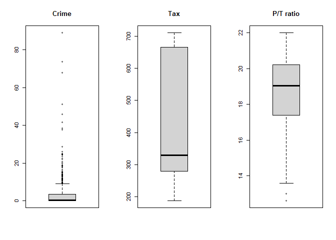

### (e)

There are 35 suburbs that bound the Charles river.

### (f)

The median pupil-teacher ratio is 19.05.

### (g)

It looks like there are two suburbs with the minimum median value of
owner occupied homes (5). Records 399 and 406. Both of these suburbs
have similar values for their other predictors:

-   Much higher than average on crime rate.
-   No zoned lots over 25,000 sq.ft.
-   Higher than average proportion of non-retail business.
-   Not bordered on the Charles River.
-   Higher than average nitrogen oxide levels.
-   Lower than average rooms per dwelling.
-   100% of units built before 1940.
-   Closer to employment centers than most suburbs.
-   High accessibility to radial highways.
-   Extremely high taxes.
-   High pupil-teacher ratio.
-   High proportion of black in town.
-   Higher proportion of population that is lower economic status.

<!-- -->

    ##        crim zn indus chas   nox    rm age    dis rad tax ptratio  black lstat
    ## 399 38.3518  0  18.1    0 0.693 5.453 100 1.4896  24 666    20.2 396.90 30.59
    ## 406 67.9208  0  18.1    0 0.693 5.683 100 1.4254  24 666    20.2 384.97 22.98
    ##     medv
    ## 399    5
    ## 406    5

### (h)

There are 64 suburbs that average more than seven rooms per dwelling and
13 suburbs that average more than eight rooms per dwelling.

For the suburbs that average more than eight rooms, they tend to be the
“better” suburbs. By “better” I mean that if you look at each of the
other variables, the suburbs with more than eight rooms tend to also be
associated with the positive outcomes of other predictors.

# Chapter 3

## Question 15

### (a)

Using a threshold of .05 as my cutoff for statistically significant, the
following predictors have a statistically significant association
between the predictor and the response using a simple linear regression,
with no transformed variables. Also, below are the plots between the
significant variables and per capita crime rate with the fitted
regression line.

    ## [1] "Significant variables are:"

    ##  [1] "zn"      "indus"   "nox"     "rm"      "age"     "dis"     "rad"    
    ##  [8] "tax"     "ptratio" "black"   "lstat"   "medv"

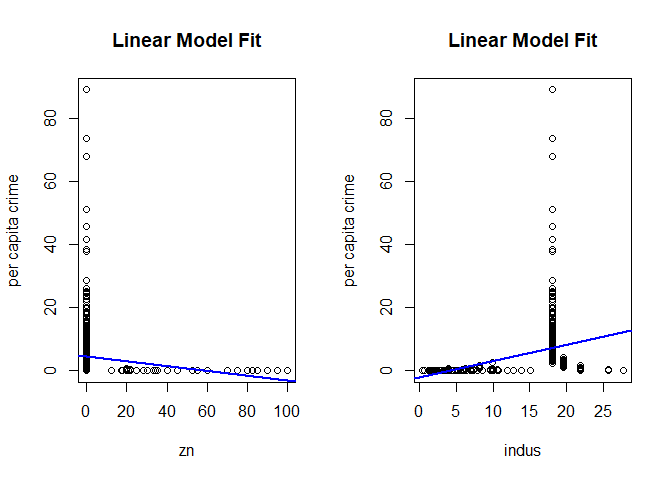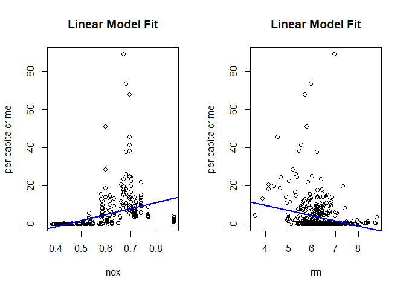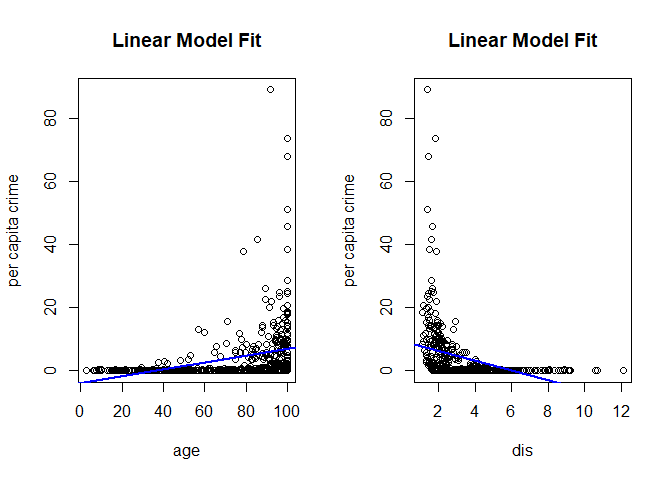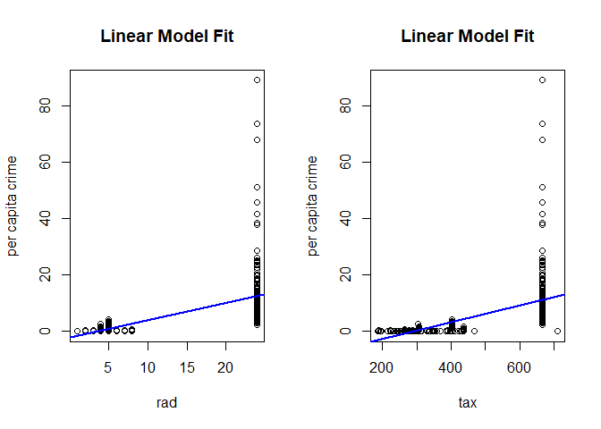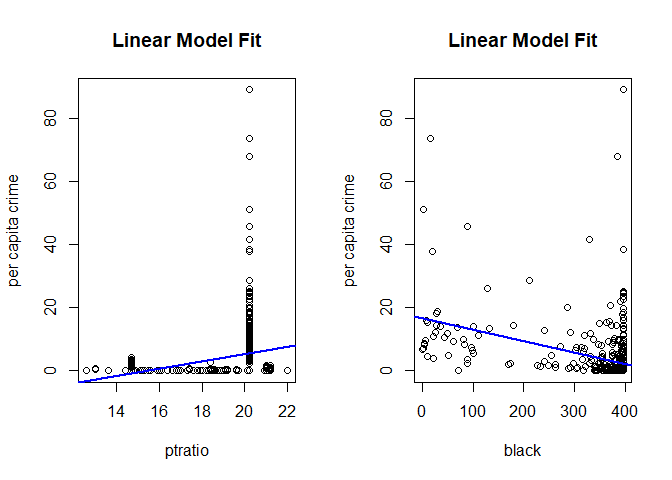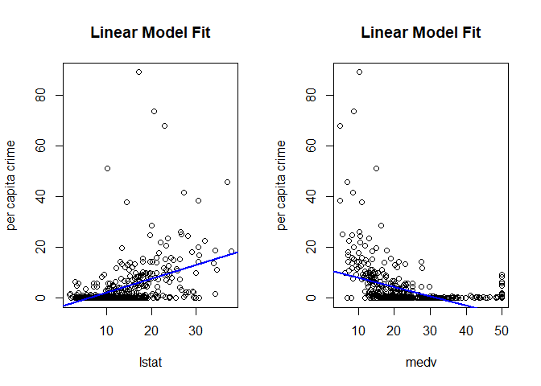

### (b)

If we use .05 as our threshold we can reject the null hypothesis for the
following predictors: zn, dis, rad, black, and medv. Much fewer than
when we examined each of the predictors independent of each other!
Summary of regression out below:

    ## 
    ## Call:
    ## lm(formula = crim ~ ., data = df)
    ## 
    ## Residuals:
    ##    Min     1Q Median     3Q    Max 
    ## -9.924 -2.120 -0.353  1.019 75.051 
    ## 
    ## Coefficients:
    ##               Estimate Std. Error t value Pr(>|t|)    
    ## (Intercept)  17.033228   7.234903   2.354 0.018949 *  
    ## zn            0.044855   0.018734   2.394 0.017025 *  
    ## indus        -0.063855   0.083407  -0.766 0.444294    
    ## chas         -0.749134   1.180147  -0.635 0.525867    
    ## nox         -10.313535   5.275536  -1.955 0.051152 .  
    ## rm            0.430131   0.612830   0.702 0.483089    
    ## age           0.001452   0.017925   0.081 0.935488    
    ## dis          -0.987176   0.281817  -3.503 0.000502 ***
    ## rad           0.588209   0.088049   6.680 6.46e-11 ***
    ## tax          -0.003780   0.005156  -0.733 0.463793    
    ## ptratio      -0.271081   0.186450  -1.454 0.146611    
    ## black        -0.007538   0.003673  -2.052 0.040702 *  
    ## lstat         0.126211   0.075725   1.667 0.096208 .  
    ## medv         -0.198887   0.060516  -3.287 0.001087 ** 
    ## ---
    ## Signif. codes:  0 '***' 0.001 '**' 0.01 '*' 0.05 '.' 0.1 ' ' 1
    ## 
    ## Residual standard error: 6.439 on 492 degrees of freedom
    ## Multiple R-squared:  0.454,  Adjusted R-squared:  0.4396 
    ## F-statistic: 31.47 on 13 and 492 DF,  p-value: < 2.2e-16

    ## [1] "(Intercept)" "zn"          "dis"         "rad"         "black"      
    ## [6] "medv"

### (c)

It looks to me that there are some significant differences in the
coefficients. The biggest flip is the coefficient for nitrogen oxide
which changes from 31.2 in the single regression case to -10.3 in the
multiple regression! This is that outlier point represented in the
bottom left of the below graph.

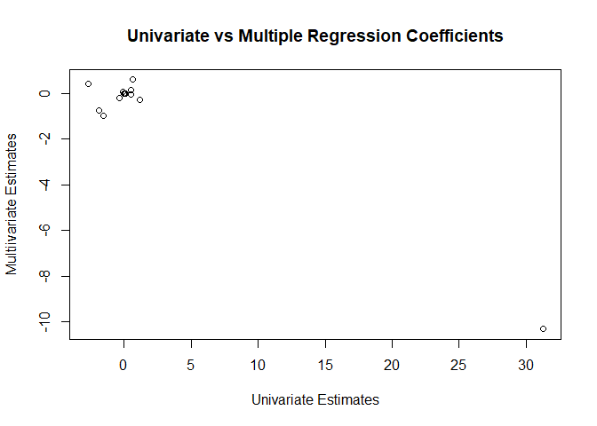

### (d)

The following predictors show evidence of a nonlinear relationship with
per capita crime:

    ##  [1] "zn"      "indus"   "nox"     "rm"      "age"     "dis"     "rad"    
    ##  [8] "tax"     "ptratio" "lstat"   "medv"

# Chapter 4

## Question 10

### (a)

The first thing I do is plot the correlation matrix (pictured below).
The biggest pattern that jumps out to me is that the volume and year are
highly correlated which we can get a clearer picture of by looking at
the plot of volume over time. As the years have gone by, the volume of
trades has increased significantly.

    ##               Year         Lag1        Lag2        Lag3         Lag4
    ## Year    1.00000000 -0.032289274 -0.03339001 -0.03000649 -0.031127923
    ## Lag1   -0.03228927  1.000000000 -0.07485305  0.05863568 -0.071273876
    ## Lag2   -0.03339001 -0.074853051  1.00000000 -0.07572091  0.058381535
    ## Lag3   -0.03000649  0.058635682 -0.07572091  1.00000000 -0.075395865
    ## Lag4   -0.03112792 -0.071273876  0.05838153 -0.07539587  1.000000000
    ## Lag5   -0.03051910 -0.008183096 -0.07249948  0.06065717 -0.075675027
    ## Volume  0.84194162 -0.064951313 -0.08551314 -0.06928771 -0.061074617
    ## Today  -0.03245989 -0.075031842  0.05916672 -0.07124364 -0.007825873
    ##                Lag5      Volume        Today
    ## Year   -0.030519101  0.84194162 -0.032459894
    ## Lag1   -0.008183096 -0.06495131 -0.075031842
    ## Lag2   -0.072499482 -0.08551314  0.059166717
    ## Lag3    0.060657175 -0.06928771 -0.071243639
    ## Lag4   -0.075675027 -0.06107462 -0.007825873
    ## Lag5    1.000000000 -0.05851741  0.011012698
    ## Volume -0.058517414  1.00000000 -0.033077783
    ## Today   0.011012698 -0.03307778  1.000000000

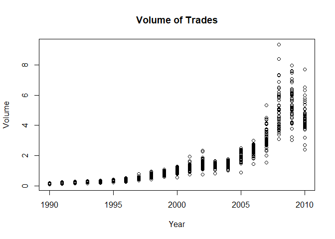

It appears there are more up weeks than down week in the market; 605 vs
484 with the mean return for an up week being 1.67% and the mean return
for a down week being -1.75%. The lowest one week return over this
period was -18.2% and the highest was 12%.

    ## # A tibble: 2 x 2
    ##   Direction   avg
    ##   <fct>     <dbl>
    ## 1 Down      -1.75
    ## 2 Up         1.67

    ##       Year           Lag1               Lag2               Lag3         
    ##  Min.   :1990   Min.   :-18.1950   Min.   :-18.1950   Min.   :-18.1950  
    ##  1st Qu.:1995   1st Qu.: -1.1540   1st Qu.: -1.1540   1st Qu.: -1.1580  
    ##  Median :2000   Median :  0.2410   Median :  0.2410   Median :  0.2410  
    ##  Mean   :2000   Mean   :  0.1506   Mean   :  0.1511   Mean   :  0.1472  
    ##  3rd Qu.:2005   3rd Qu.:  1.4050   3rd Qu.:  1.4090   3rd Qu.:  1.4090  
    ##  Max.   :2010   Max.   : 12.0260   Max.   : 12.0260   Max.   : 12.0260  
    ##       Lag4               Lag5              Volume            Today         
    ##  Min.   :-18.1950   Min.   :-18.1950   Min.   :0.08747   Min.   :-18.1950  
    ##  1st Qu.: -1.1580   1st Qu.: -1.1660   1st Qu.:0.33202   1st Qu.: -1.1540  
    ##  Median :  0.2380   Median :  0.2340   Median :1.00268   Median :  0.2410  
    ##  Mean   :  0.1458   Mean   :  0.1399   Mean   :1.57462   Mean   :  0.1499  
    ##  3rd Qu.:  1.4090   3rd Qu.:  1.4050   3rd Qu.:2.05373   3rd Qu.:  1.4050  
    ##  Max.   : 12.0260   Max.   : 12.0260   Max.   :9.32821   Max.   : 12.0260  
    ##  Direction 
    ##  Down:484  
    ##  Up  :605  
    ##            
    ##            
    ##            
    ## 

The returns appear to have a roughly normal distribution except for the
fat tails.

    ## `stat_bin()` using `bins = 30`. Pick better value with `binwidth`.

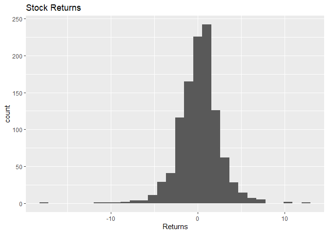

### (b)

The only predictor that appears to be significant is the 2 week lag
return.

    ## 
    ## Call:
    ## glm(formula = Direction ~ Lag1 + Lag2 + Lag3 + Lag4 + Lag5 + 
    ##     Volume, family = binomial, data = Weekly)
    ## 
    ## Deviance Residuals: 
    ##     Min       1Q   Median       3Q      Max  
    ## -1.6949  -1.2565   0.9913   1.0849   1.4579  
    ## 
    ## Coefficients:
    ##             Estimate Std. Error z value Pr(>|z|)   
    ## (Intercept)  0.26686    0.08593   3.106   0.0019 **
    ## Lag1        -0.04127    0.02641  -1.563   0.1181   
    ## Lag2         0.05844    0.02686   2.175   0.0296 * 
    ## Lag3        -0.01606    0.02666  -0.602   0.5469   
    ## Lag4        -0.02779    0.02646  -1.050   0.2937   
    ## Lag5        -0.01447    0.02638  -0.549   0.5833   
    ## Volume      -0.02274    0.03690  -0.616   0.5377   
    ## ---
    ## Signif. codes:  0 '***' 0.001 '**' 0.01 '*' 0.05 '.' 0.1 ' ' 1
    ## 
    ## (Dispersion parameter for binomial family taken to be 1)
    ## 
    ##     Null deviance: 1496.2  on 1088  degrees of freedom
    ## Residual deviance: 1486.4  on 1082  degrees of freedom
    ## AIC: 1500.4
    ## 
    ## Number of Fisher Scoring iterations: 4

### (c)

The fraction of correct predictions is: 611/1089 (56%). Looking at the
prop table with the marginal probabilities we can see that we correctly
capture 92% of the up weeks but we only correctly capture 11% of the
down days.

    ##         Direction
    ## glm.pred Down  Up
    ##     Down   54  48
    ##     Up    430 557

    ## 
    ## 
    ## Prop table with marginal probabilities:

    ##         Direction
    ## glm.pred Down   Up
    ##     Down 0.11 0.08
    ##     Up   0.89 0.92

    ## [1] 0.5610652

### (d)

The fraction of correct predictions on the test data when only using
Lag2 is 65/104 (62.5%).

    ##         
    ## glm.pred Down Up
    ##     Down    9  5
    ##     Up     34 56

    ## [1] 0.625

### (g)

The fraction of correct predictions is 52/104 (50%).

    ##            
    ## knn_predict Down Up
    ##        Down   22 31
    ##        Up     21 30

    ## [1] 0.5

### (h)

Based on the previous results, it appears that using logistic regression
with only Lag2 as a predictor yields the best results as it has the
highest out of sample accuracy.

### (i)

I attempted a variety of different combinations of the predictors,
including interactions and one new variable: the average return of the
past 5 weeks. I also tried k sizes of 1-20 for the knn models.
Unfortunately, none of my models made any improvement on the
classification and the best model was still the one that used Lag2 as
the only predictor as detailed in part d. This is a little frustrating,
but I suppose it is a bit refreshing that the model that performed the
best is the simplest.

# Chapter 6

## Question 9

### (a)

The data is split into a training and test set. Half of the data is in
each.

### (b)

The root MSE of this least squares linear regression model is indicated
below.

    ## [1] 1160.091

### (c)

The optimal lambda, chosen through cross validation and the root MSE for
the ridge regression are printed below:

    ## [1] "Best Lamba: 345.198515480354"

    ## [1] "Root MSE: 1430.45687422799"

### (d)

The optimal lambda, chosen through cross validation and the root MSE for
the lasso regression are printed below. Also below is the number of
non-zero coefficients in this model, including the intercept term.

    ## [1] "Best Lamba: 30.0236063295516"

    ## [1] "Root MSE: 1192.9255351587"

    ## [1] "The number of non-zero coefficients, inlcuding the intercept term is: 14"

### (e)

The test error for the principal components regression is shown below.
The M that was chosen through cross validation was 17. You can see this
result by examining the validation plot below.

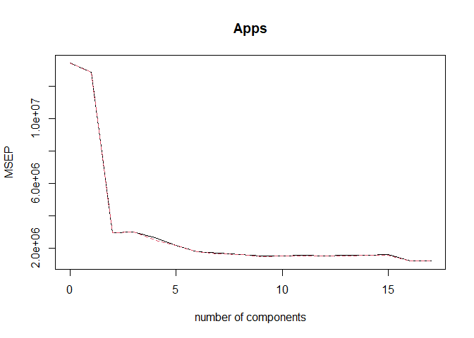

    ## [1] "Root MSE: 1160.09095026152"

### (f)

The test error for the principal components regression is shown below.
The M that was chosen through cross validation was this was the M, that
produced the lowest Root MSE in cross validation which can be seen in
the summary below.

    ## Data:    X dimension: 389 17 
    ##  Y dimension: 389 1
    ## Fit method: kernelpls
    ## Number of components considered: 17
    ## 
    ## VALIDATION: RMSEP
    ## Cross-validated using 10 random segments.
    ##        (Intercept)  1 comps  2 comps  3 comps  4 comps  5 comps  6 comps
    ## CV            3662     1587     1355     1159     1146     1090     1039
    ## adjCV         3662     1582     1367     1156     1139     1086     1036
    ##        7 comps  8 comps  9 comps  10 comps  11 comps  12 comps  13 comps
    ## CV        1024     1023     1028      1029      1031      1031      1029
    ## adjCV     1020     1019     1023      1025      1026      1026      1024
    ##        14 comps  15 comps  16 comps  17 comps
    ## CV         1029      1029      1029      1029
    ## adjCV      1024      1024      1024      1024
    ## 
    ## TRAINING: % variance explained
    ##       1 comps  2 comps  3 comps  4 comps  5 comps  6 comps  7 comps  8 comps
    ## X       26.84    51.48    63.89    67.72    72.01    75.57    78.69    81.30
    ## Apps    82.31    86.47    90.68    91.65    92.44    93.05    93.29    93.34
    ##       9 comps  10 comps  11 comps  12 comps  13 comps  14 comps  15 comps
    ## X       84.62     87.07     90.01     91.39     92.79     95.19     96.94
    ## Apps    93.36     93.38     93.39     93.39     93.39     93.39     93.39
    ##       16 comps  17 comps
    ## X        98.47    100.00
    ## Apps     93.39     93.39

    ## [1] "Root MSE: 1168.28949125335"

### (g)

The test results of our models are shown below. We benchmark the results
of each model off of our base case, which is the standard deviation of
the predicted data itself. Which tells us how good our predictions would
be if we used no model and simply predicted the mean of Apps every time.

It looks like we do improve our predictions quite a bit by using these
models. There is not a lot of variability in test error between the
models, but for this particular set of testing and training data, it
looks like the simple least squares model performs the best as it has
the smallest root mse.

    ## [1] "Standard Deviation: 4073.82449541212"

    ## [1] "Root MSE for Least Squares: 1160.09095026152"

    ## [1] "Root MSE for ridge: 1430.45687422799"

    ## [1] "Root MSE for lasso: 1192.9255351587"

    ## [1] "Root MSE for PCR: 1160.09095026152"

    ## [1] "Root MSE:  for PLS 1168.28949125335"

## Question 11

### (a)

First, I split the Boston data into testing and training. Half the
observations are in each set.

The first technique for model selection I will use is subset selection.
I use forward, backward, and step methodologies for subset selection.

The test results for each model are shown below. Along with the number
of coefficients included in each model. For my particular sample of the
data, it appears that I get the same result by using any of the subset
methods. I always end up at 9 coefficients.

    ## [1] "Root MSE and coefficient count for full LM is:"

    ## [1] "Root MSE =  8.60134857802926"

    ## [1] "Coefficient Count =  14"

    ## [1] "Root MSE and coefficient count for forward LM is:"

    ## [1] "Root MSE =  8.56811409624329"

    ## [1] "Coefficient Count =  9"

    ## [1] "Root MSE and coefficient count for backward LM is:"

    ## [1] "Root MSE =  8.56811409624329"

    ## [1] "Coefficient Count =  9"

    ## [1] "Root MSE and coefficient count for step LM is:"

    ## [1] "Root MSE =  8.56811409624329"

    ## [1] "Coefficient Count =  9"

Next, I try to use a lasso model. I like lasso more than ridge because
it will actually zero out certain coefficients and exclude them from the
model. Unlike ridge, which will simply decrease the coefficient.

The lasso model actually does not exclude any of the predictors which is
pretty interesting. That sort of makes me feel like I am doing something
wrong here, but I can’t really see what it could be. Assuming everything
is correct, the Lasso model should give the same results as the normal
least squares.

    ## [1] "Root MSE for lasso is  8.56811409624329"

    ## [1] "The number of non-zero coefficients, inlcuding the intercept term is: 14"

The final model I will try is the PCR model.

As shown below the cross validated error looks like it drops off at
around 4 components. For that reason, I will choose 4 as the number of
components. The test Root MSE is also printed below.

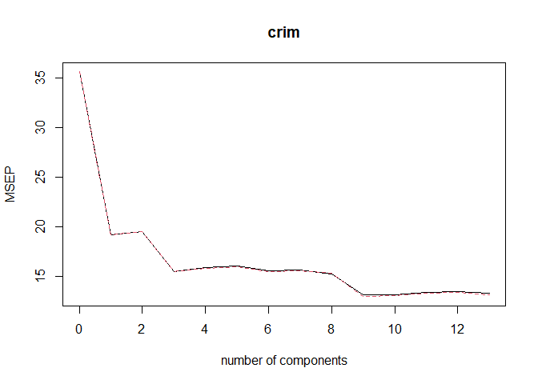

    ## [1] "Root MSE for PCR =  8.75894559800157"

### (b)

The model I am going to go with here is the model that is produced
through subset selection. All three methods of subset selection gave me
the same model which has 9 coefficients and the lowest test RMSE of all
the models tried. A summary of the model output is below:

    ## 
    ## Call:
    ## lm(formula = crim ~ rad + lstat + black + zn + dis + nox + indus + 
    ##     rm, data = train_boston)
    ## 
    ## Residuals:
    ##     Min      1Q  Median      3Q     Max 
    ## -8.1378 -1.4812 -0.0943  0.9977 27.4137 
    ## 
    ## Coefficients:
    ##              Estimate Std. Error t value Pr(>|t|)    
    ## (Intercept) 10.306469   4.247191   2.427  0.01596 *  
    ## rad          0.418601   0.034526  12.124  < 2e-16 ***
    ## lstat        0.256332   0.049743   5.153 5.29e-07 ***
    ## black       -0.009489   0.003003  -3.160  0.00178 ** 
    ## zn           0.037564   0.012882   2.916  0.00387 ** 
    ## dis         -0.641325   0.198168  -3.236  0.00138 ** 
    ## nox         -7.440440   3.551902  -2.095  0.03722 *  
    ## indus       -0.088262   0.057463  -1.536  0.12584    
    ## rm          -0.629535   0.427914  -1.471  0.14253    
    ## ---
    ## Signif. codes:  0 '***' 0.001 '**' 0.01 '*' 0.05 '.' 0.1 ' ' 1
    ## 
    ## Residual standard error: 3.442 on 244 degrees of freedom
    ## Multiple R-squared:  0.6768, Adjusted R-squared:  0.6662 
    ## F-statistic: 63.87 on 8 and 244 DF,  p-value: < 2.2e-16

### (c)

My model does not include all of the features in the data set. Some
predictors were dropped as the chosen model only has 9 coefficients.
Part of the reason I chose this model was because it discarded a few of
the variables. I find this appealing because it makes my model a little
bit simpler to interpret and probably less prone to over fitting future
data.

# Chapter 8

## Question 8

### (a)

The data is now split into training and testing. Half is in training and
half is in testing.

### (b)

Results for the fitted tree are below including number of nodes, test
MSE, and the variance of sales. This shows that our model does make some
improvement by reducing the prediction error. Also, below is the plotted
tree. Event thought the plot is cluttered and tough to read, we can see
that shelf location and price seem to be the two variables that have the
biggest impact on sales.

    ## [1] "Nodes in tree =  19"

    ## [1] "Test MSE of tree =  4.19642611155957"

    ## [1] "Standard Deviation of Sales =  7.5531125"

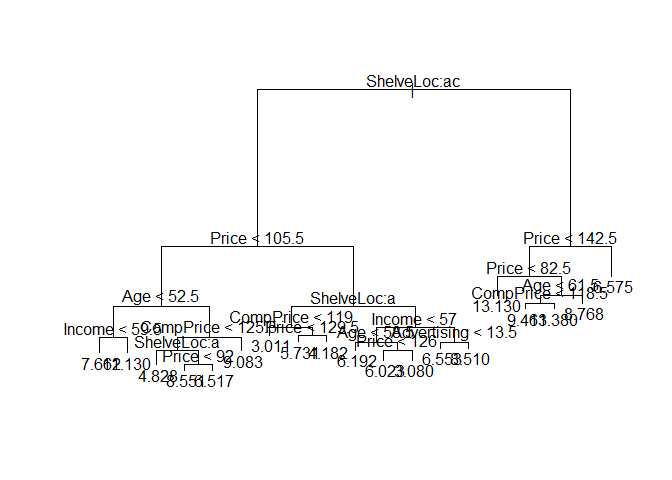

### (c)

Now I use cross validation to determine the optimal level of tree
complexity. In this case, the tree is not actually pruned because cross
validation determines that the optimal tree has 18 nodes, which is no
different from before. You can see in the graph below how the error
declines as the number of nodes increases. Because this is the same
model as before, there will be no change in MSE. The R function used
here is ‘cv.tree’ which does a 10 fold cross validation methodology as
its default.

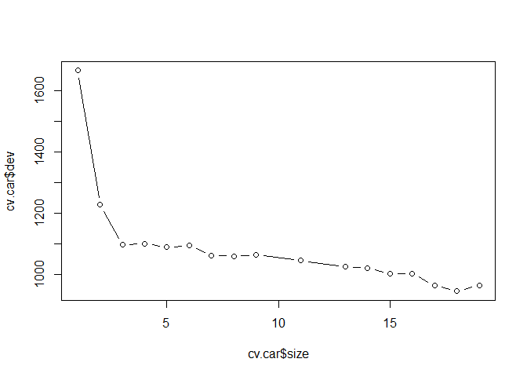

### (d)

Now I run the bagging model. The result here is an MSE that is much
lower than a simple tree. We can also see from the importance summary
that the three most import variables are Price, Shelf Location,
competitors price,and age.

    ## [1] "The test MSE obtained is:  2.74976850013307"

    ##                %IncMSE IncNodePurity
    ## CompPrice   21.9676486    151.497040
    ## Income       4.6334313     82.847374
    ## Advertising 14.0114503     97.835541
    ## Population  -1.1161058     60.486845
    ## Price       46.6977263    451.405868
    ## ShelveLoc   53.4614464    548.570179
    ## Age         18.9002570    145.738716
    ## Education    0.2497633     37.392432
    ## Urban       -1.8072121      6.337751
    ## US          -0.6805385      6.370240

### (e)

Finally, the random forest. The main difference here is that we only use
3 predictors for each tree in our forest. The test MSE obtained is below
which is a bit worse than bagging. The importance summary amd plots
provide us with the same information as with bagging: Price, shelf
location competitor price, and age are the most important variables.

    ## [1] "The test MSE obtained is:  3.18359140605552"

    ##                 %IncMSE IncNodePurity
    ## CompPrice   10.50988697     139.26847
    ## Income       2.84755248     105.82148
    ## Advertising 10.86431875     131.93309
    ## Population  -3.01958509     107.20305
    ## Price       31.35871223     381.09859
    ## ShelveLoc   40.57757955     387.29984
    ## Age         13.18345902     179.85271
    ## Education   -0.03551222      66.92497
    ## Urban       -1.74023359      11.60459
    ## US           2.35476926      17.60592

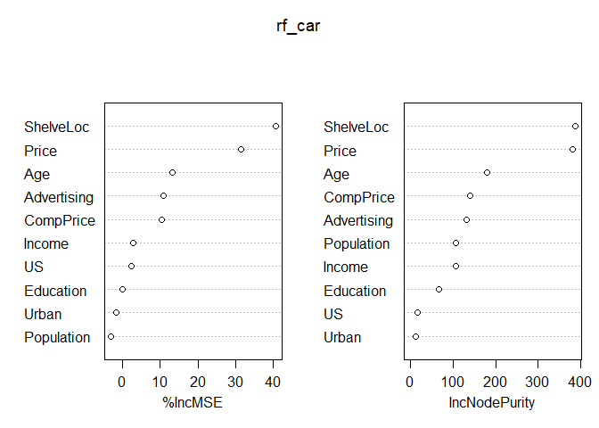

Now we examine how the results of the random forest change as we alter
the number of variables considered in each split. Below is a graph of
the test MSE as a function of number of predictors. It looks like it
levels off at 4 variables and reaches its lowest MSE at 5 variables.

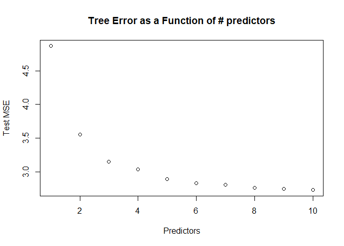

## Quesiton 11

### (a)

Training set created consisting of the first 1000 observations. The rest
are put in a test set.

### (b)

We fit a boosting model using 1000 trees and a shrinkage value of .01.
With this model we can see below the relative importance of the
variables. The top three predictors are: PPERSAUT, MKOOPKLA, and
MOPLHOOG.

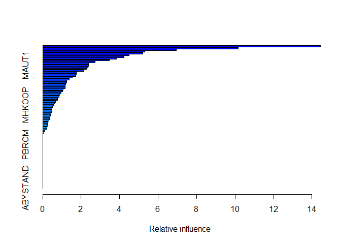

    ##               var     rel.inf
    ## PPERSAUT PPERSAUT 14.44495286
    ## MKOOPKLA MKOOPKLA 10.17212000
    ## MOPLHOOG MOPLHOOG  6.94130018
    ## MBERMIDD MBERMIDD  5.32190122
    ## PBRAND     PBRAND  5.20937097
    ## ABRAND     ABRAND  4.49333261
    ## MGODGE     MGODGE  4.22711608
    ## MINK3045 MINK3045  3.82769108
    ## MAUT2       MAUT2  3.46715144
    ## MOSTYPE   MOSTYPE  2.73387895
    ## MBERARBG MBERARBG  2.39566711
    ## MAUT1       MAUT1  2.38282947
    ## MGODPR     MGODPR  2.35838757
    ## PWAPART   PWAPART  2.29367738
    ## MSKC         MSKC  2.14712891
    ## MGODOV     MGODOV  1.77240681
    ## MSKA         MSKA  1.74322808
    ## MBERHOOG MBERHOOG  1.73193599
    ## MGODRK     MGODRK  1.54488669
    ## PBYSTAND PBYSTAND  1.38204152
    ## MFWEKIND MFWEKIND  1.25406148
    ## MRELGE     MRELGE  1.24654421
    ## MINKM30   MINKM30  1.19637917
    ## MSKB1       MSKB1  1.18189972
    ## MINK7512 MINK7512  1.15880343
    ## MINKGEM   MINKGEM  1.06078804
    ## MAUT0       MAUT0  1.02742089
    ## MOPLMIDD MOPLMIDD  0.96165747
    ## MHHUUR     MHHUUR  0.88679853
    ## MINK4575 MINK4575  0.84482341
    ## MRELOV     MRELOV  0.76965160
    ## MFGEKIND MFGEKIND  0.76869955
    ## MSKD         MSKD  0.67997000
    ## MGEMLEEF MGEMLEEF  0.61195760
    ## MHKOOP     MHKOOP  0.55683058
    ## MOSHOOFD MOSHOOFD  0.50346175
    ## PMOTSCO   PMOTSCO  0.48062735
    ## MBERBOER MBERBOER  0.46980586
    ## APERSAUT APERSAUT  0.45621949
    ## PLEVEN     PLEVEN  0.43765087
    ## MOPLLAAG MOPLLAAG  0.40906235
    ## MSKB2       MSKB2  0.37589217
    ## MGEMOMV   MGEMOMV  0.34581954
    ## MRELSA     MRELSA  0.32466481
    ## MFALLEEN MFALLEEN  0.28247158
    ## MZPART     MZPART  0.25280213
    ## MZFONDS   MZFONDS  0.24548422
    ## MINK123M MINK123M  0.22056403
    ## MBERARBO MBERARBO  0.21921611
    ## MBERZELF MBERZELF  0.11923050
    ## MAANTHUI MAANTHUI  0.05973664
    ## PWABEDR   PWABEDR  0.00000000
    ## PWALAND   PWALAND  0.00000000
    ## PBESAUT   PBESAUT  0.00000000
    ## PAANHANG PAANHANG  0.00000000
    ## PTRACTOR PTRACTOR  0.00000000
    ## PWERKT     PWERKT  0.00000000
    ## PBROM       PBROM  0.00000000
    ## PPERSONG PPERSONG  0.00000000
    ## PGEZONG   PGEZONG  0.00000000
    ## PWAOREG   PWAOREG  0.00000000
    ## PZEILPL   PZEILPL  0.00000000
    ## PPLEZIER PPLEZIER  0.00000000
    ## PFIETS     PFIETS  0.00000000
    ## PINBOED   PINBOED  0.00000000
    ## AWAPART   AWAPART  0.00000000
    ## AWABEDR   AWABEDR  0.00000000
    ## AWALAND   AWALAND  0.00000000
    ## ABESAUT   ABESAUT  0.00000000
    ## AMOTSCO   AMOTSCO  0.00000000
    ## AAANHANG AAANHANG  0.00000000
    ## ATRACTOR ATRACTOR  0.00000000
    ## AWERKT     AWERKT  0.00000000
    ## ABROM       ABROM  0.00000000
    ## ALEVEN     ALEVEN  0.00000000
    ## APERSONG APERSONG  0.00000000
    ## AGEZONG   AGEZONG  0.00000000
    ## AWAOREG   AWAOREG  0.00000000
    ## AZEILPL   AZEILPL  0.00000000
    ## APLEZIER APLEZIER  0.00000000
    ## AFIETS     AFIETS  0.00000000
    ## AINBOED   AINBOED  0.00000000
    ## ABYSTAND ABYSTAND  0.00000000

### (c)

The predictions of the boosting model were used to create the below
confusion matrix. We predicted that someone will make a purchase if
their predicted probability of making a purchase is greater than 20%.

Of people that are predicted to make a purchase (173), 37 of those
people actually make a purchase. Or 21%.

    ##                  
    ## purchase_predicts    0    1
    ##                 0 4397  252
    ##                 1  136   37

Now how about with logistic regression?

The confusion matrix below shows the results. The proportion of people
predicted to purchase, that actually purchased is 14%. Quite a bit worse
than by using boosting.

    ## Warning: glm.fit: fitted probabilities numerically 0 or 1 occurred

    ## Warning in predict.lm(object, newdata, se.fit, scale = 1, type = if (type == :
    ## prediction from a rank-deficient fit may be misleading

    ##                  
    ## purchase_predicts    0    1
    ##                 0 4183  231
    ##                 1  350   58

# Problem 1: Beauty Pays!

## 1.)

So we need to understand the affect of beauty on course evaluation
ratings of professors. Before diving in with a model, I’ll do some
exploratory analysis first.

Let’s examine what the data looks like to just get a feel for it:

    ## # A tibble: 10 x 6
    ##    CourseEvals BeautyScore female lower nonenglish tenuretrack
    ##          <dbl>       <dbl>  <dbl> <dbl>      <dbl>       <dbl>
    ##  1        3.24      0.202       1     0          0           1
    ##  2        3.23     -0.826       0     0          0           1
    ##  3        3.65     -0.660       0     0          0           1
    ##  4        3.37     -0.766       1     0          0           1
    ##  5        4.29      1.42        1     0          0           1
    ##  6        4.24      0.500       0     0          0           1
    ##  7        3.01     -0.214       1     0          0           1
    ##  8        3.84     -0.347       1     0          0           1
    ##  9        3.55      0.0613      1     0          0           1
    ## 10        4.45      0.453       0     0          0           0

Now pull in some summary data and understand the dimensions of the data
set:

    ##   CourseEvals     BeautyScore           female           lower       
    ##  Min.   :1.944   Min.   :-1.53884   Min.   :0.0000   Min.   :0.0000  
    ##  1st Qu.:3.326   1st Qu.:-0.74462   1st Qu.:0.0000   1st Qu.:0.0000  
    ##  Median :3.682   Median :-0.15636   Median :0.0000   Median :0.0000  
    ##  Mean   :3.689   Mean   :-0.08835   Mean   :0.4212   Mean   :0.3391  
    ##  3rd Qu.:4.067   3rd Qu.: 0.45725   3rd Qu.:1.0000   3rd Qu.:1.0000  
    ##  Max.   :5.000   Max.   : 1.88167   Max.   :1.0000   Max.   :1.0000  
    ##    nonenglish       tenuretrack    
    ##  Min.   :0.00000   Min.   :0.0000  
    ##  1st Qu.:0.00000   1st Qu.:1.0000  
    ##  Median :0.00000   Median :1.0000  
    ##  Mean   :0.06048   Mean   :0.7797  
    ##  3rd Qu.:0.00000   3rd Qu.:1.0000  
    ##  Max.   :1.00000   Max.   :1.0000

    ## [1] 463   6

Now let’s look at the correlation between the variables. Beauty score
and course evaluations do appear to be correlated!

    ##             CourseEvals BeautyScore       female       lower   nonenglish
    ## CourseEvals  1.00000000  0.40709120 -0.231829451 -0.24864349 -0.079891096
    ## BeautyScore  0.40709120  1.00000000  0.125719400  0.03257686  0.010293330
    ## female      -0.23182945  0.12571940  1.000000000 -0.05657933  0.003805072
    ## lower       -0.24864349  0.03257686 -0.056579333  1.00000000 -0.143448262
    ## nonenglish  -0.07989110  0.01029333  0.003805072 -0.14344826  1.000000000
    ## tenuretrack -0.03760944 -0.01913483 -0.074315467 -0.13663972  0.134859291
    ##             tenuretrack
    ## CourseEvals -0.03760944
    ## BeautyScore -0.01913483
    ## female      -0.07431547
    ## lower       -0.13663972
    ## nonenglish   0.13485929
    ## tenuretrack  1.00000000

We can get some more summary information about different groups we are
interested in below. It looks like females have a higher beauty score on
average, though there is slightly more variation in their scores.

    ## # A tibble: 2 x 4
    ##   female avg_beauty_score median_beauty_score sd_beauty_score
    ##    <dbl>            <dbl>               <dbl>           <dbl>
    ## 1      0          -0.173               -0.326           0.757
    ## 2      1           0.0278              -0.145           0.818

What about a graph or two to gain some insight? From the first plot you
can clearly see that there is a positive association between beauty and
course ratings. The second plot shows the same plot except broken out by
sex. It looks to me that there is a slightly stronger affect on course
evaluation for females than males. This tells me that I may want to
include it as an interaction term in my regression.

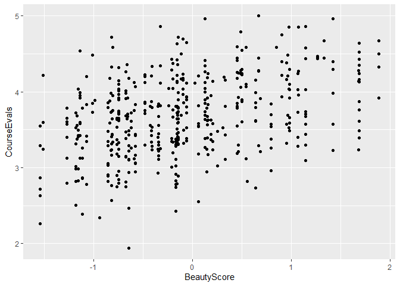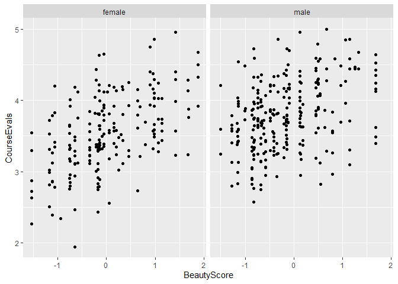

Now, on to estimating the affect of beauty on course evaluations.

I first estimate the affect with a single variable linear regression.
You can see the summary below. The coefficient displayed for BeautyScore
is .27148, but I won’t put too much effort into any interpretation yet
until I utilize another model that controls for the *other
determinants*.

    ## 
    ## Call:
    ## lm(formula = CourseEvals ~ BeautyScore, data = BeautyData)
    ## 
    ## Residuals:
    ##     Min      1Q  Median      3Q     Max 
    ## -1.5936 -0.3346  0.0097  0.3702  1.2321 
    ## 
    ## Coefficients:
    ##             Estimate Std. Error t value Pr(>|t|)    
    ## (Intercept)  3.71340    0.02249 165.119   <2e-16 ***
    ## BeautyScore  0.27148    0.02837   9.569   <2e-16 ***
    ## ---
    ## Signif. codes:  0 '***' 0.001 '**' 0.01 '*' 0.05 '.' 0.1 ' ' 1
    ## 
    ## Residual standard error: 0.4809 on 461 degrees of freedom
    ## Multiple R-squared:  0.1657, Adjusted R-squared:  0.1639 
    ## F-statistic: 91.57 on 1 and 461 DF,  p-value: < 2.2e-16

To that end, I have estimated a multivariate regression to include the
other variables. Summary output is below. You can see that the
BeautyScore coefficient has reason to .30415. This coefficient is higher
than the previous model because we are now controlling for other
variables that impact course rating. You can see that all of the
coefficients are statistically significant at the .05 threshold.

From this model, I would estimate that for each incremental increase of
a unit of BeautyScore, the course evaluation rating will increase by
.30415.

    ## 
    ## Call:
    ## lm(formula = CourseEvals ~ ., data = BeautyData)
    ## 
    ## Residuals:
    ##      Min       1Q   Median       3Q      Max 
    ## -1.31385 -0.30202  0.01011  0.29815  1.04929 
    ## 
    ## Coefficients:
    ##             Estimate Std. Error t value Pr(>|t|)    
    ## (Intercept)  4.06542    0.05145  79.020  < 2e-16 ***
    ## BeautyScore  0.30415    0.02543  11.959  < 2e-16 ***
    ## female      -0.33199    0.04075  -8.146 3.62e-15 ***
    ## lower       -0.34255    0.04282  -7.999 1.04e-14 ***
    ## nonenglish  -0.25808    0.08478  -3.044  0.00247 ** 
    ## tenuretrack -0.09945    0.04888  -2.035  0.04245 *  
    ## ---
    ## Signif. codes:  0 '***' 0.001 '**' 0.01 '*' 0.05 '.' 0.1 ' ' 1
    ## 
    ## Residual standard error: 0.4273 on 457 degrees of freedom
    ## Multiple R-squared:  0.3471, Adjusted R-squared:  0.3399 
    ## F-statistic: 48.58 on 5 and 457 DF,  p-value: < 2.2e-16

After running the above model, I wanted to also incorporate the possible
interaction of BeautyScore with other predictors. This is primarily
motivated by the plot in my exploratory analysis that depicted
relationship of beauty on course rating, segmented by sex. Those plots
appeared to show a different relationship for males and females. Perhaps
for females beauty has a stronger impact on their rating? The summary
output for this new model is shown below.

As the summary shows, none of the new predictors are statistically
significant.Perhaps with more data we could further tease out these
relationships to see if anything is there.

    ## 
    ## Call:
    ## lm(formula = CourseEvals ~ . + BeautyScore:female + BeautyScore:lower + 
    ##     BeautyScore:nonenglish + BeautyScore:tenuretrack, data = BeautyData)
    ## 
    ## Residuals:
    ##      Min       1Q   Median       3Q      Max 
    ## -1.28676 -0.29836  0.01589  0.28392  1.06096 
    ## 
    ## Coefficients:
    ##                         Estimate Std. Error t value Pr(>|t|)    
    ## (Intercept)              4.07729    0.05201  78.391  < 2e-16 ***
    ## BeautyScore              0.30943    0.07076   4.373 1.52e-05 ***
    ## female                  -0.32483    0.04145  -7.836 3.35e-14 ***
    ## lower                   -0.34792    0.04333  -8.030 8.51e-15 ***
    ## nonenglish              -0.22957    0.08620  -2.663  0.00802 ** 
    ## tenuretrack             -0.12195    0.05009  -2.435  0.01529 *  
    ## BeautyScore:female       0.08216    0.05307   1.548  0.12228    
    ## BeautyScore:lower       -0.04893    0.05427  -0.902  0.36775    
    ## BeautyScore:nonenglish   0.36504    0.27747   1.316  0.18898    
    ## BeautyScore:tenuretrack -0.03497    0.06215  -0.563  0.57393    
    ## ---
    ## Signif. codes:  0 '***' 0.001 '**' 0.01 '*' 0.05 '.' 0.1 ' ' 1
    ## 
    ## Residual standard error: 0.4264 on 453 degrees of freedom
    ## Multiple R-squared:  0.3553, Adjusted R-squared:  0.3425 
    ## F-statistic: 27.74 on 9 and 453 DF,  p-value: < 2.2e-16

## 2.)

I think what Dr. Hamermesh means is that for observational studies like
this one, you can never perfectly isolate the relationship you are
looking for. There may always be other confounding factors at play. We
can only build up a case with the evidence we have. It is possible that
beautiful people are simply better teachers than non-beautiful teachers.
If we wanted further evidence, we would need to conduct a controlled
experiment, where all factors are held constant between two cases,
except for our variable of interest, which would be beauty. That may not
be feasible for this case! We could try to concoct some sort of
experiment by having professors teach two courses where everything else
is the same, except in one class they are made to look less attractive
somehow. Could be a fun experiment!

# PRoblem2: Housing Price Structure

## 1.)

Getting a feel for the data:

    ## # A tibble: 6 x 7
    ##   Nbhd  Offers  SqFt Brick Bedrooms Bathrooms  Price
    ##   <fct>  <dbl> <dbl> <chr>    <dbl>     <dbl>  <dbl>
    ## 1 2          2  1790 No           2         2 114300
    ## 2 2          3  2030 No           4         2 114200
    ## 3 2          1  1740 No           3         2 114800
    ## 4 2          3  1980 No           3         2  94700
    ## 5 2          3  2130 No           3         3 119800
    ## 6 1          2  1780 No           3         2 114600

    ## [1] 128   7

    ##  Nbhd       Offers           SqFt         Brick              Bedrooms    
    ##  1:44   Min.   :1.000   Min.   :1450   Length:128         Min.   :2.000  
    ##  2:45   1st Qu.:2.000   1st Qu.:1880   Class :character   1st Qu.:3.000  
    ##  3:39   Median :3.000   Median :2000   Mode  :character   Median :3.000  
    ##         Mean   :2.578   Mean   :2001                      Mean   :3.023  
    ##         3rd Qu.:3.000   3rd Qu.:2140                      3rd Qu.:3.000  
    ##         Max.   :6.000   Max.   :2590                      Max.   :5.000  
    ##    Bathrooms         Price       
    ##  Min.   :2.000   Min.   : 69100  
    ##  1st Qu.:2.000   1st Qu.:111325  
    ##  Median :2.000   Median :125950  
    ##  Mean   :2.445   Mean   :130427  
    ##  3rd Qu.:3.000   3rd Qu.:148250  
    ##  Max.   :4.000   Max.   :211200

To determine if there is a premium for brick houses, I run a
multivariate regression on this data. Summary output below.

It does indeed appear that there is a sizable premium for brick houses
since the coefficient below for BrickYes is 17297. Meaning brick houses
command about a $17,000 premium over non brick houses, all else equal.

    ## 
    ## Call:
    ## lm(formula = Price ~ ., data = midcity)
    ## 
    ## Residuals:
    ##      Min       1Q   Median       3Q      Max 
    ## -27337.3  -6549.5    -41.7   5803.4  27359.3 
    ## 
    ## Coefficients:
    ##              Estimate Std. Error t value Pr(>|t|)    
    ## (Intercept)  2159.498   8877.810   0.243  0.80823    
    ## Nbhd2       -1560.579   2396.765  -0.651  0.51621    
    ## Nbhd3       20681.037   3148.954   6.568 1.38e-09 ***
    ## Offers      -8267.488   1084.777  -7.621 6.47e-12 ***
    ## SqFt           52.994      5.734   9.242 1.10e-15 ***
    ## BrickYes    17297.350   1981.616   8.729 1.78e-14 ***
    ## Bedrooms     4246.794   1597.911   2.658  0.00894 ** 
    ## Bathrooms    7883.278   2117.035   3.724  0.00030 ***
    ## ---
    ## Signif. codes:  0 '***' 0.001 '**' 0.01 '*' 0.05 '.' 0.1 ' ' 1
    ## 
    ## Residual standard error: 10020 on 120 degrees of freedom
    ## Multiple R-squared:  0.8686, Adjusted R-squared:  0.861 
    ## F-statistic: 113.3 on 7 and 120 DF,  p-value: < 2.2e-16

## 2.)

To determine if there is a premium for houses in neighborhood 3 I can
look at the previous regression output and observe the coefficient
associated with neighbordhood 3 which is 20681. It appears that there is
indeed a big premium for houses in this neighborhood as they command
around a 21,000 premium over houses in neighborhood 1, all else equal.

## 3.)

To determine if there is a premium for brick houses in neighborhood 3, I
run a new regression, but this time, I include an interaction term
between brick and neighborhood. The summary output is below.

From this output you can see that brick houses in neighborhood 3 do
indeed command a premium. These houses command a premium of almost
12,000.

    ## 
    ## Call:
    ## lm(formula = Price ~ . + Brick:Nbhd, data = midcity)
    ## 
    ## Residuals:
    ##      Min       1Q   Median       3Q      Max 
    ## -27225.1  -5219.0   -273.7   4297.4  27507.2 
    ## 
    ## Coefficients:
    ##                 Estimate Std. Error t value Pr(>|t|)    
    ## (Intercept)     3695.511   8829.382   0.419  0.67631    
    ## Nbhd2          -1317.656   2679.849  -0.492  0.62385    
    ## Nbhd3          16980.797   3437.529   4.940 2.60e-06 ***
    ## Offers         -8381.770   1068.248  -7.846 2.15e-12 ***
    ## SqFt              53.745      5.686   9.453 3.96e-16 ***
    ## BrickYes       12093.056   4082.168   2.962  0.00369 ** 
    ## Bedrooms        4777.216   1586.397   3.011  0.00318 ** 
    ## Bathrooms       6457.287   2160.867   2.988  0.00341 ** 
    ## Nbhd2:BrickYes  2668.449   5068.893   0.526  0.59957    
    ## Nbhd3:BrickYes 11933.197   5341.027   2.234  0.02735 *  
    ## ---
    ## Signif. codes:  0 '***' 0.001 '**' 0.01 '*' 0.05 '.' 0.1 ' ' 1
    ## 
    ## Residual standard error: 9847 on 118 degrees of freedom
    ## Multiple R-squared:  0.8752, Adjusted R-squared:  0.8657 
    ## F-statistic: 91.94 on 9 and 118 DF,  p-value: < 2.2e-16

## 4.)

I would say that you probably could combine neighborhoods 2 and 3 for
the purposes of prediction. My primary motivation for saying this is
because the coefficient on neighborhood 2 is not statistically
significant. By combining the variables, we could reduce complexity
slightly and probably reduce over fitting.

# Problem 3: What causes what??

## 1.)

The issue there is that police and crime are almost certainly highly
positively correlated with each other because generally a city with lots
of crime will require police to manage that crime. In that cause you
would likely have a positive coefficient for your regression parameter
and you would interpret that as a sign that higher police are associated
with more crime!

## 2.)

They were able to isolate the effect by regressing crime on high alert.
A variable which served as a proxy for large numbers of police out
because of a terrorist watch. This was the researchers’ creative way to
hold everything else constant except for the number of police.

If police have an negative impact on crime, you would expect this
coefficient to be negative.

## 3.)

They needed to control for metro ridership because the researchers
wanted to make sure that crime would not be decreasing for some other
reason, like decreased city activity. If there was some other
confounding claim, they would not be able to draw the conclusion of a
causal relationship.

## 4.)

The model being estimated here is whether or not the decrease in crime
on high alert periods differs by district. It does appear that district
1 on high alert has a decrease in crime while we probably can’t say that
with certainty for other districts because the coefficient is not
statistically significant.

# Problem 4: Neural Nets

Using cross validation to determine the optimal parameters for size and
decay. The best size and decay are reported below, along with the root
MSE for test data.

Also pictured below is a scatter plot to show how the prediction match
up with the actual values. It appears to be a pretty tight fit and a
substantially better test RMSE than using regressions!

    ## [1] "Best size =  7"

    ## [1] "Best decay =  0.25"

    ## [1] "Best RMSE =  3.51979929841367"

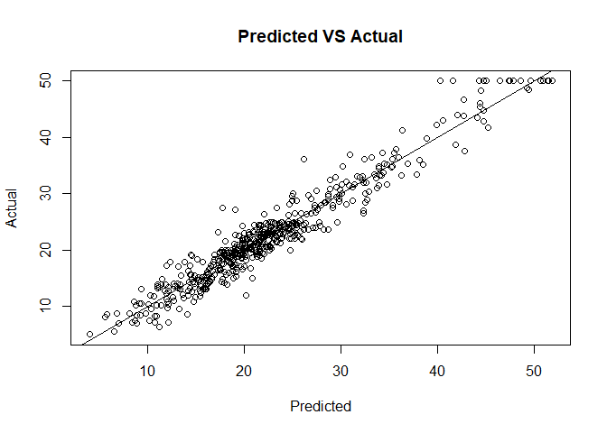

# Problem 5: Final Project

At the risk of sounding arrogant, I think I made a healthy contribution
to our final project. I was responsible for ‘cleaning’ our data. I did
this with Python and Pandas because I am much more comfortable with
python than R at the moment, and I was able to do this relatively
quickly. We made a fair number of changes and transformations to our
data set and the python script I created made the process of repeatedly
updating our cleaned data set smooth. I think one of my bigger
contributions was helping my team understand what we needed to do to our
original data before we could use it. In one of our meetings, I went
through our data set to talk through each of the variables we had so we
could discuss what we should do with the variable: keep, transform, or
drop. Once we got to the model building phase, I took on the role of
creating a random forest. The other two big roles I had were as code
compiler and conceptual shepherd. Once my teammates created the code for
their models, they sent them to me, and I went through the process of
combining all of our code into one R file for submission. During that
process I cleaned up the code a bit to make it more understandable and
made sure all the pieces fit together. My role of conceptual shepherd
came into play during this code compilation and while we were building
our presentation. While adjusting our code, I made a concerted effort to
make sure we were not blindly applying the models that we learned in
class without appropriately adjusting them for our specific needs.
During our presentation preparation, I think I made important
contributions to our teams’ message by ensuring that we were all
accurately conveying the results of our models, and not simply
regurgitating something we saw in the textbook or heard in class that
did not make sense in the context of our problem.
